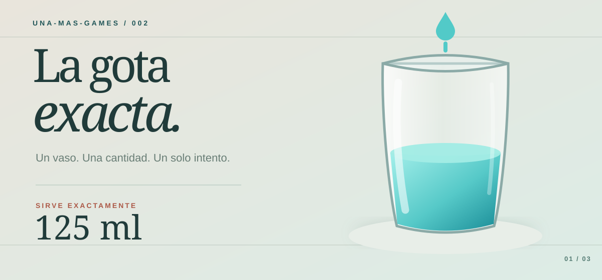

<div align="center">



# La Gota Exacta

**Un vaso. Una cantidad. Un solo intento.**

[](https://goyoaga.github.io/la-gota-exacta/)


</div>

---

## El reto

Una cantidad en **ml** aparece sobre un vaso transparente. Mantén pulsado para llenarlo y suelta cuando creas que llegaste al objetivo. El número vertido se revela **después**. La forma del vaso cambia cómo sube el líquido.

<div align="center">

**OBJETIVO VISIBLE** &nbsp; → &nbsp; **MANTENER PULSADO** &nbsp; → &nbsp; **SOLTAR UNA VEZ** &nbsp; → &nbsp; **VEREDICTO**

</div>

| Lo que ves | Lo que haces |
| :--- | :--- |
| Objetivo entre 90 y 200 ml en un vaso de 250 ml | Estimas el nivel según la forma del recipiente. |
| Tres perfiles: recto, ancho abajo y ancho arriba | Mantienes pulsado el botón con el dedo o ratón; con teclado, **Espacio**. |
| Resultado en ml y diferencia real | Intentas mejorar tu récord personal en «Otra ronda». |

**Puntuación:** menos de 1 ml de diferencia es «¡Gota exacta!» y cae confeti; entre 1 y 5 ml es «Casi perfecto». Si te alejas más, el juego te dice si faltó o sobró. El récord se guarda en el navegador mediante `localStorage`. El confeti se omite si el dispositivo tiene activada la preferencia de movimiento reducido.

## Diseñado para una pausa

- Una ronda, un solo vertido y vuelta a jugar sin menús ni cuenta.
- Líquido **azul turquesa translúcido** y vasos 3D con volumen y altura coherentes.
- Controles táctiles, ratón y barra espaciadora; veredicto como texto fuera del lienzo 3D.
- Sonido suave de líquido generado en el navegador al mantener pulsado; se detiene al soltar. El botón ♫ permite silenciarlo y recuerda la preferencia en el navegador.
- Botón ☆ para aprender a guardarlo en favoritos. El navegador debe confirmar el marcador: una web no puede hacerlo sola.
- Sin publicidad, backend ni recopilación de datos personales en el juego.

## Jugar y publicar

**Repositorio:** https://github.com/goyoaga/la-gota-exacta  
**Juego (tras activar Pages):** https://goyoaga.github.io/la-gota-exacta/

Para publicar: entra en **Settings → Pages → Build and deployment → Source: GitHub Actions**. Después ejecuta **Actions → Publicar en GitHub Pages → Run workflow** (o envía un nuevo commit a `main`). La compilación usa la ruta base `/la-gota-exacta/` y publica el contenido de `dist`. Espera el estado verde y abre la URL del juego para comprobar una ronda.

### Ejecutar en local

Requiere Node.js 22 o superior y npm:

```bash
npm ci
npm run dev
```

Vite indicará la URL de desarrollo. Para verificar la compilación:

```bash
npm run build
npm run preview
```

**Vite sí se utiliza**: sirve el entorno de desarrollo y genera los archivos estáticos publicados por GitHub Actions. Three.js dibuja la escena; HTML y CSS presentan controles y resultado. El flujo de volumen se calcula en JavaScript sin motor de físicas.

## Cómo funciona el vaso

Cada forma usa un perfil de radio `r(h)`. El volumen de cada altura se calcula integrando la sección del vaso y se normaliza a 250 ml. El vaso, el líquido y las marcas se dibujan con ese mismo perfil. Por eso **100 ml** no llega a la misma altura en las tres formas, aunque el resultado matemático sea idéntico.

El contador interno avanza a 25 ml por segundo de pulsación activa. La pestaña oculta o el gesto cancelado cierran la ronda: el líquido no sigue avanzando en segundo plano. Los valores de ritmo y dificultad podrán ajustarse tras pruebas de juego.

## Apoya el proyecto

¿Lo pasaste bien durante un par de minutos? [Invítame un café en Ko-fi ☕](https://ko-fi.com/arielgoyoaga). Es totalmente voluntario y el juego siempre es gratuito.

---

<div align="center">

Hecho para **UNA-MAS-GAMES** · una partida más y seguimos.

</div>
